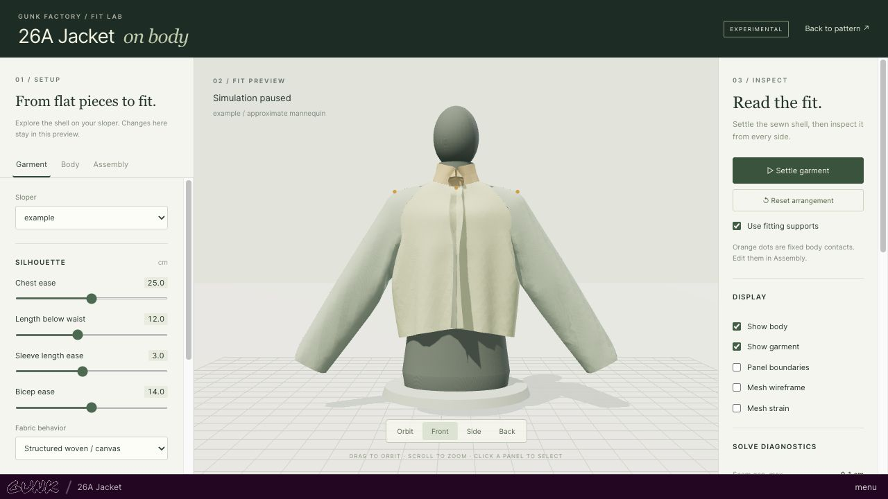

# Optional garment fit preview: research kickoff

Kickoff: 2026-09-29. Prototype and research update: 2026-09-30. A working experimental shell preview now exists, with an adapter API and reproducible numerical experiments. The continuation after the usage reset improves shoulder geometry and solver behavior, while documenting substantial remaining limits.

## Objective

Render garments from the existing pattern system on a body inferred from a selected sloper. Help designers inspect approximate proportions, ease, and fit before production. Keep this an optional module with its own assembly metadata, controls, and runtime.

## Repository findings

- React 18, TypeScript, Vite, hash routing, and static GitHub Pages deployment. No backend is required by the current workflow.
- `src/garments/garment.d.ts` exposes `draft(measurements, params) -> DraftResult`.
- `src/pattern/pattern.d.ts` already provides ordered seam-line edges in centimeters, seam allowances, fold edges, cut counts, mirroring, grain, notches, and marks. It does not identify sewn edge pairs or 3D placement.
- `src/pattern/production.ts` expands folds and mirrored copies for cutting. A preview adapter must retain original piece/edge identity through equivalent operations; expanded display names alone are insufficient identifiers.
- `src/components/pattern-view/index.tsx` selects slopers and garment parameters and invokes drafting. Pattern display, packing, and projection share this component.
- `src/components/renderer/` contains a JSCAD/regl viewer, but the active garment view renders SVG. Existing rendering dependencies do not themselves provide garment assembly or cloth simulation.
- `slopers/example.json` contains 18 measurements: useful upper-body and arm dimensions, but no explicit waist girth, elbow girth, forearm length, hip height, or full-body height.
- The sole garment, `26a-jacket`, includes shell, facings, collar layers, two-piece raglan sleeves, pockets, throat tab, lining with a back pleat, and folded rib cuffs. Closure can be overlapping fronts or a zip.
- The sewing instructions identify waxed cotton for the shell. Numeric fabric properties are absent.

Baseline checks before implementation: `npm run build` passes. `npm run lint` fails because `src/hooks/useAnimationFrame.ts:27` has two existing `react-hooks/exhaustive-deps` warnings and the command permits none. Working tree was clean before this document.

## Scope agreed with the designer

1. Research, architecture, and a working experimental jacket preview.
2. Approximate mannequin with adjustable proportions, prioritizing garment proportions, ease, and obvious fit problems.
3. Desktop Chrome and Safari on a Mac as the initial support target.

These are scope preferences, not approvals for paid services or deployment.

## Proposed module boundary

Use a separate `src/fit-preview/` module, loaded only when a designer opens the preview. Its adapter reads existing draft output and sloper measurements. Assembly metadata lives alongside this module rather than in garment definitions or pattern types. Minimal application wiring can expose a separate preview route or entry point.

Dependency direction:

```text
existing garment.draft(...) + sloper
                 |
                 v
         read-only preview adapter
                 |
     body + assembly + material settings
                 |
       mesh and simulation worker
                 |
          optional 3D viewer
```

Keep drafting, geometry, cutting, packing, and projection behavior unchanged. Avoid mutations of draft output, including nested point arrays. Keep preview preferences separate from saved production parameters. Prototype preview controls should not silently overwrite a designer's pattern choices.

An assembly document needs a schema version, garment slug/version, a pattern topology signature, instantiated pieces, paired boundary ranges, seam direction, intentional easing, closures, placement landmarks, and material assignments. A topology mismatch should require remapping rather than silently sewing the wrong edges. The first jacket adapter can assign semantic names to existing edge indices without changing the source pattern.

## Research workstreams and experiments

### Body inference

Start with a procedural torso, neck, shoulders, and arms in a fixed fitting pose. Fit circumferences and front/back arcs where available. The example chest circumference can be derived as `2 * (halfFrontChest + halfBackChest) = 100 cm`; do not confuse either half-front arc with a straight width or full girth.

Distinguish supplied measurements, derived quantities, and assumed proportions. Missing dimensions must not become zero. Provide optional overrides for torso depth, shoulder slope, abdomen profile, and arm proportions. A circumference admits many cross-sectional shapes, so the model is an estimate rather than a unique reconstruction.

Test generated measurement loops against requested values, and inspect collision geometry and visible geometry together. Resolve conflicting inputs explicitly. Build the body from sloper values independently of garment ease; a change in jacket ease must not resize the person. Compare procedural fitting with licensed statistical body models before adopting model assets.

### Assembly and mesh construction

Create cloth from seam-line geometry; seam allowances should not inflate the simulated finished garment. Preserve the original 2D rest metric. Handle duplicate boundary points, winding changes after mirroring, fold continuity, concavity, and adequate interior triangulation.

Represent a sewn relationship between ordered edge ranges, including direction and arc-length correspondence. Notches supply correspondence hints. Unequal lengths may be intentional easing and must not automatically be forced to match by scaling the pattern.

Begin with the back, mirrored fronts, and both halves of each sleeve. Map raglan, lower armhole, overarm, side, and underarm seams. Add neckline/collar attachment and closure behavior next. Overlapping fronts require closure attachments at their intended locations, not sewing the two outermost front edges together. Treat lining, facings, pocket attachment to panel interiors, pleats, folded cuffs, and stretch as separate assembly cases.

### Simulation and rendering

Initial candidate: Three.js WebGL 2 rendering with a cloth solver running in a Web Worker. Assess extended position-based dynamics (XPBD) for stretching, shear, bending, seam constraints, and body collision. Use fixed simulation substeps independent of rendering frequency and explicit physical units. Prototype with simple swatches before a complete jacket.

Separate initial arrangement from physical constraints: place a sleeve around an arm, then release placement aids as seams close. A cloth region near a body landmark should generally be allowed to slide; permanent pins can conceal bad fit. Persistent attachments should be explicit designer choices.

Evaluate self-collision, collision thickness, friction, underarm tangling, seam closure order, and initialization sensitivity. A stable-looking solve can still have incorrect strain or intersections. Display nonconvergence and unresolved intersections rather than reporting successful fit.

Compare this candidate with reusable cloth implementations and native solvers compiled to WebAssembly. Audit package and asset licenses and build compatibility before adoption. Measure performance before considering GPU compute. A graphics backend fallback does not establish a fallback for a custom compute solver.

### Designer interface

- Body view: orbit, front/back/side views, sloper selection, inferred dimensions, and optional body-shape overrides.
- Assembly view: 2D pieces next to 3D placement, selection of boundary ranges to sew, direction indicators, mismatch lengths, and unpaired-edge diagnostics. Free openings must be distinguishable from missing seams.
- Placement view: assign pieces or regions to body landmarks with orientation and offset; distinguish temporary arrangement from permanent attachment.
- Fit view: settle/pause/reset, garment/body visibility, seam overlays, closure state, and quantitative diagnostics. Strain visualization should be labeled as model strain, not calibrated pressure or comfort.
- Save/export assembly metadata independently of patterns; provide a preconfigured assembly for the existing jacket and an authoring path for future garments.

## Milestones and evidence

1. **Reproducible baseline and dependency choice:** record build/lint state; compare renderer, solver, mesher, and body approaches with sources and license notes.
2. **Body prototype:** generate and display the example sloper, validate circumference targets and unit equivalence, list assumptions, and exercise incomplete inputs.
3. **Assembly adapter:** instantiate mirrored/fold pieces with stable references; validate seam topology and lengths against the jacket's construction instructions.
4. **Solver experiments:** hanging swatch, two sewn panels, a sleeve around an arm, then the outer jacket. Record mesh sizes, solve time, seam residuals, stretch, and body penetration.
5. **Integrated optional preview:** load the example jacket; orbit and inspect it; compare changes to chest ease and sleeve length; exercise closure and arrangement controls.
6. **Validation and handoff:** build, module checks, manual browser interaction, screenshots, observed limitations, and prioritized follow-up work. Verify existing pattern output is unchanged and the 3D payload is loaded only on demand.

Use targeted geometry and simulation tests where they establish meaningful invariants. Suggested fixtures include centimeter/inch/millimeter equivalents, missing measurements, mirrored winding, unfolded boundaries, seam direction, a concave panel, degenerate input, and an intentionally mismatched seam. Profile on named hardware and browser versions; performance targets remain provisional until measured.

A successful research result can identify an unsuccessful approach. The handoff must distinguish implemented functionality, measured results, untested recommendations, and unresolved blockers. A shell prototype must explicitly identify omitted layers; it cannot substantiate full lined-jacket fit.

## Initial primary sources

These are starting references, not a completed technology comparison. Accessed 2026-09-29.

- [Three.js renderer guidance](https://threejs.org/manual/pages/webgpurenderer): describes WebGPU rendering with WebGL 2 fallback, and retains WebGLRenderer as the recommended renderer for applications using only WebGL 2. This supports evaluating a conservative WebGL 2 prototype.
- [Macklin, Müller, and Chentanez: XPBD (2016)](https://matthias-research.github.io/pages/publications/XPBD.pdf): compliance-based constraint formulation addressing timestep/iteration dependence in traditional PBD. Candidate algorithm, not a ready-made validated garment simulator.
- [SMPL project](https://smpl.is.tue.mpg.de/): a learned body model with registration and licensing requirements and a separate commercial licensing contact. Do not assume publicly described model weights are freely redistributable in this application.

At kickoff, no runtime dependencies or application changes had been made. The implementation below subsequently adds two runtime dependencies and no body assets, service accounts, backend, or scheduled jobs.

## Implemented prototype

Open `#/fit/26a-jacket`, or use the **Fit preview** link on the garment page. The feature lives under `src/fit-preview/` and is lazy-loaded. The existing pattern, garment, measurement, production, packing, and projector sources are unchanged. Integration adds only a route, route-local error UI, and navigation link.



The screenshot shows the supported shell after settling. The fabric presets and mannequin remain approximate; the numerical diagnostics still flag local deformation.

Implemented capabilities:

- A sloper-derived torso, neck, and arms, with explicit measured/derived/assumed dimensions and adjustable depth, shoulder slope, and arm pose.
- Ten simulated half-panels: two fronts, two back halves joined at their fold, four half-sleeves, and two outer collar halves joined at their fold. There are 18 assembly relationships, plus optional center-front closure constraints.
- Directed seam chains, approximate arc-length stitching, fold continuity, stable panel instances, and a separate versioned assembly document.
- Piece selection in 3D and 2D, selectable seam edges, editable seam direction, seam enable/disable, and manual initial placement offsets.
- Explicit body contacts at named shoulder/neck/wrist landmarks. Three default fitting supports are visible as orange dots and can be removed individually or disabled together.
- Local save/load, validated JSON import, JSON export, and a copyable JSON fallback.
- A worker-based cloth solve, pause/reset, front/side/back cameras, panel boundaries, wireframe, strain shading, and numerical diagnostics.

The module guide at `src/fit-preview/README.md` documents schema semantics and how another garment adapter can reuse the engine. This is an implementation of the first outer-shell milestone, not completion of every workstream in the original roadmap.

## Technology decisions

| Area | Decision for this prototype | Alternatives and next decision |
| --- | --- | --- |
| Drawing | Three.js 0.180.0, direct WebGL 2 renderer | WebGPU is an optional later renderer/compute route. Keep rendering and solver backends independent. |
| React integration | A small imperative viewer component with lifecycle cleanup | A React-specific 3D wrapper would add another version compatibility surface without solving garment assembly. |
| Body | Original procedural elliptical loft and tapered arm segments | A statistical model could represent more realistic correlations; it still needs fitting, missing-data priors, and a compatible asset license. |
| Meshing | poly2tri 1.5.0 constrained triangulation, interior grid points, boundary sampling around 2.8 cm | A quality mesher with minimum-angle control and local refinement is preferable before accurate strain interpretation. |
| Physics | A readable TypeScript CPU reference, compliant distance constraints inspired by XPBD, fixed timestep, worker execution | Investigate anisotropic triangle strain and proper bending before optimizing this simplified spring model. |
| Collision | Analytic torso/arm projection | Continuous mesh contact, friction, self-collision, and layer handling are the principal next physics work. |
| Assembly | Sidecar recipe referring to existing piece/edge identity | Partial edges, notch correspondence, internal attachment curves, elastic easing, and stable semantic edge IDs need schema extensions. |
| Persistence | Explicit local save/load and portable assembly JSON | Keep measurement identity, garment parameters, and simulation snapshots separate if a fuller project format is added. |

These are engineering judgments for this repository, supported by the following primary references:

- Three.js documents WebGL 2 rendering and a separate WebGPU renderer with fallback. The prototype uses its conservative WebGL path and requires no WebGPU compute. [Renderer guidance](https://threejs.org/manual/pages/webgpurenderer), [BufferGeometry](https://threejs.org/docs/pages/BufferGeometry.html), [OrbitControls](https://threejs.org/docs/pages/OrbitControls.html).
- XPBD supplies a compliance-based formulation useful for iterative constraints. Our implementation uses it for distance and seam constraints; it does not reproduce a full constitutive cloth model. [Original XPBD paper](https://matthias-research.github.io/pages/publications/XPBD.pdf).
- The Small Steps paper motivates comparing substeps and iterations rather than merely increasing passes. The continuation evaluates those choices and uses 1/480 s with three passes. This is a measured prototype tradeoff, not a claim of calibrated cloth mechanics. [Small Steps in Physics Simulation](https://matthias-research.github.io/pages/publications/smallsteps.pdf).
- The MIT-licensed PositionBasedDynamics project offers richer cloth constraints and signed-distance collision, but its C++/CMake/Eigen stack would require a browser build and integration effort. It is a candidate reference or WebAssembly backend, not a drop-in JavaScript garment editor. [Project and supported constraints](https://github.com/InteractiveComputerGraphics/PositionBasedDynamics).
- poly2tri accepts constrained boundaries and added interior points. Its documentation restricts unsupported inputs such as intersecting edges. The application catches triangulation failures rather than fabricating a mesh. Its legacy root entry references Node's `global`; importing the triangulation implementation directly avoids adding a global browser shim. [poly2tri project](https://github.com/r3mi/poly2tri.js).
- SMPL is a learned body representation, with model access/licensing requirements. No SMPL assets are included here. [SMPL project](https://smpl.is.tue.mpg.de/).
- MakeHuman distinguishes software licensing from its CC0 core graphics assets. That makes asset-based body fitting worth evaluating later; it does not establish that a particular downloaded community asset or fitting implementation has the same terms. No MakeHuman assets were downloaded. [MakeHuman licensing](https://static.makehumancommunity.org/about/license.html).

Three.js uses MIT and poly2tri uses BSD-3-Clause. The exact installed notices are shipped at `public/fit-preview-notices.txt`. Versions are pinned in `package.json` and `yarn.lock`.

## First prototype experiments and findings

The initial solver gave a recognizable silhouette but left collar seams separated by several centimeters. Increasing visual quality would have concealed a geometry problem. Tracing residuals by seam identified both poor initial collar arrangement and a collision response error.

1. A tilted circular collar could begin inside the shoulder. Arranging it along the actual directed neckline chain was a better starting condition.
2. Purely horizontal torso projection pushed neckline vertices sideways when the nearest exit was upward over a shoulder. Including the vertical gradient of the body loft reduced the default maximum seam gap to about 2 mm.
3. A low-strain solve could still be a garment falling off a frictionless body. Visible fitting supports and motion diagnostics now distinguish that condition. Supports are an explicit modeling assumption, not an invisible numerical stabilization.
4. Uniform particle masses, coarse triangles, approximate bending, and simplified collision still produce large local edge strain around armholes. The UI continues to label that state unresolved even when average strain and seam closure look acceptable.

These retained benchmarks precede the shoulder and substep changes described below. They use Node v25.5.0 on this macOS arm64 host, 360 steps at 1/120 s with 10 passes, structured-woven preset, closed front, and three fitting supports. They are CPU solver measurements, not browser FPS measurements. Exact CPU model was not recorded. Each row is one run; timings are indicative, not statistical performance guarantees.

| Scenario | Vertices / triangles | Solve time | Max seam gap | Mean absolute edge strain | Max absolute edge strain | Final motion / step |
| --- | ---: | ---: | ---: | ---: | ---: | ---: |
| Default: chest ease 25 cm, bicep ease 14 cm | 1,976 / 3,354 | 4.73 s | 1.96 mm | 2.66% | 67.6% | 0.00029 cm |
| Closer chest: ease 10 cm | 1,910 / 3,230 | 4.78 s | 1.70 mm | 2.73% | 67.0% | 0.00029 cm |
| Roomier: chest ease 40 cm, bicep ease 22 cm | 2,128 / 3,644 | 5.35 s | 2.07 mm | 2.71% | 72.7% | 0.00050 cm |

All three reported zero residual body penetration at the sampled vertices. This says nothing about triangle crossings or cloth self-intersections. High local strain means these solves cannot support pressure, comfort, or production-fit claims. The average strains are similar across variants and must not be interpreted as an accurate ranking of garment tightness.

Machine-readable results, including per-seam gaps and the largest strain locations:

- `docs/fit-preview-results/default.json`
- `docs/fit-preview-results/closer-chest.json`
- `docs/fit-preview-results/relaxed.json`

Those files retain the initial implementation's results; the current code and command produce the revised results below.

## Continuation after the usage reset

The largest initial armhole errors were extensions, not compressed folds. Looking at their sign and 3D positions helped identify two separate causes: contact geometry and finite solver resolution.

The original arm capsule was centered on the measured shoulder tip. That put a whole arm radius above a surface landmark and effectively flattened the estimated shoulder slope. The corrected center is offset inward along the shoulder surface normal. The visible joint and collider now meet the surface landmark, and the default supports and sleeve arrangement use the actual shoulder height. This is an anatomical approximation; it still does not recover an individual's shoulder shape from sparse measurements.

With the corrected body, a three-second timestep/iteration sweep gave:

| Timestep | Passes / step | Total steps | Mean absolute edge strain | Max absolute edge strain | Max seam gap |
| --- | ---: | ---: | ---: | ---: | ---: |
| 1/120 s | 10 | 360 | 2.54% | 48.1% | 3.90 mm |
| 1/240 s | 10 | 720 | 1.06% | 25.8% | 1.54 mm |
| 1/240 s | 20 | 720 | 0.85% | 21.5% | 1.77 mm |
| 1/360 s | 5 | 1,080 | 0.98% | 25.3% | 1.22 mm |
| 1/480 s | 3 | 1,440 | 0.96% | 24.9% | 1.09 mm |

All rows use time-normalized damping and the corrected body. Collision is enforced on the final pass, including odd pass counts. The final sweep was rerun sequentially after fixing pinned-particle prediction; its JSON snapshots include single-run timings. The table emphasizes geometry residuals rather than runtime claims. `solver-sensitivity.json` retains these measurements; explicit solver settings in the benchmark command reproduce the configurations. The default uses the last row: fewer passes per simulated second than the 1/240 s configurations, a smaller seam residual, and similar peak deformation. It does not eliminate the local stretching. The largest residuals moved to the upper center front/back in this fixture.

The interface now separates stretch and compression, reports collapsed faces below 10% of their rest area, and reports RMS cloth motion in cm/s. Reporting displacement per step would make a faster timestep appear more settled. Missing required seams, repeated assignments, and intentional shell openings have separate counts; selecting a seam exposes its residual gap. Conflicting contacts snapped to the same coarse vertex fail with an actionable error. These are numerical diagnostics, not calibrated fit scores.

The mesher now takes arrangement and interior-attachment callbacks, so jacket placement and closure no longer live in the general engine. `adapter.ts` registers garment-specific panels, recipes, controls, and simulation setup. `api.ts` exposes the engine without importing React or Three.js. A new garment can register an adapter without modifying pattern types or the current garment library. The preview also starts with the pattern page's selected sloper and keeps its later edits separate.

## Current reproducible case sweep

`npm run research:fit` runs these nine cases sequentially using only the public example sloper and synthetic variations. Defaults are 1/480 s, three passes, three simulated seconds, 2.8 cm spacing, structured-woven preset, closed front, and fitting supports unless stated otherwise. Timings are single CPU runs on macOS arm64 / Node v25.5.0. They exclude meshing but include result diagnostics; they are not browser FPS measurements or statistical performance estimates.

| Case | Vertices | Time | Seam gap | Mean strain | Max stretch | Max compression | RMS motion |
| --- | ---: | ---: | ---: | ---: | ---: | ---: | ---: |
| Default | 1,976 | 7.42 s | 1.09 mm | 0.96% | 24.9% | 8.6% | 0.06 cm/s |
| Chest ease 10 cm | 1,910 | 7.19 s | 1.10 mm | 0.99% | 24.4% | 9.2% | 0.03 cm/s |
| Chest ease 40 cm, bicep ease 22 cm | 2,128 | 7.99 s | 1.18 mm | 0.98% | 26.0% | 9.2% | 0.05 cm/s |
| Example lengths scaled to 85% | 1,554 | 5.87 s | 1.05 mm | 0.79% | 14.2% | 9.6% | 13.85 cm/s |
| Example lengths scaled to 120% | 2,580 | 9.26 s | 1.18 mm | 0.95% | 24.9% | 12.1% | 0.07 cm/s |
| Arms 60°, slope 30°, depth ratio 0.85 | 1,976 | 7.20 s | 0.78 mm | 0.84% | 15.8% | 20.4% | 0.23 cm/s |
| Soft woven, open front | 1,976 | 7.26 s | 0.91 mm | 1.61% | 28.9% | 10.8% | 0.08 cm/s |
| Supports disabled | 1,976 | 7.12 s | 1.79 mm | 0.83% | 23.6% | 10.5% | 0.11 cm/s |
| Finer 2 cm mesh | 3,676 | 13.43 s | 4.53 mm | 1.24% | 45.2% | 13.2% | 0.26 cm/s |

All nine were finite, with zero collapsed faces and zero sampled-vertex body penetration at the end. The smaller fixture was still moving; it must resume settling before interpretation. The unsupported jacket remained on this body's neckline after three seconds, but that isolated result does not validate unsupported drape, friction, or robustness to other initial placements.

The finer mesh result is a significant failure of resolution independence. Uniform particle masses, spring mechanics, constraint propagation, meshing, and contact all need further investigation. Increased detail must not be treated as increased accuracy. Likewise, similar average strain across different ease values does not establish an accurate tightness ranking. The UI's unresolved state remains visible for high local deformation.

`docs/fit-preview-results/current-summary.json` and the nine named snapshots record effective solver/body/material settings, dimensions, counts, seam residuals, and signed peak deformation locations. The first three updated filenames end in `-current` to preserve the original baseline. `npm run benchmark:fit -- '{}' '{"spacing":2}'` reproduces the finer case. Other experimental settings can override body options, measurement scale/values, material, closure, supports, steps, or solver settings.

## Additional backend and body references

These projects were inspected through their primary documentation; none was installed, benchmarked, or incorporated. The decisions in the last column are inferences for this repository.

| Candidate | Relevant evidence | Role in this project |
| --- | --- | --- |
| GarmentCode / GarmentCodeData | MIT pattern-programming framework; its garment data pipeline uses a fork of NVIDIA Warp, with simulation quality checks for failed drapes. [Project](https://github.com/maria-korosteleva/GarmentCode), [simulation pipeline](https://github.com/maria-korosteleva/GarmentCode/blob/main/docs/Running_data_generation.md) | Useful reference for sewing interfaces, initialization, and reference fixtures. Adopting its drafting system would violate the requested module boundary. An offline comparison would require an export adapter. |
| NVIDIA Warp | Python kernels compile to CPU C++ or CUDA; this is not a documented browser execution backend. [Official FAQ](https://github.com/NVIDIA/warp/blob/main/docs/user_guide/faq.rst) | Potential offline reference, not a direct replacement for the browser worker. A native/browser port is a separate project. |
| GarmentMeasurements | Shape sampling and measurement tool using C++/CMake, CGAL, and FBX SDK; repository identifies GPL-3.0. [Project](https://github.com/mbotsch/GarmentMeasurements) | Useful measurement-loop reference. Code, dependencies, and any shape assets need their own license/build review before adoption. |
| WASM Cloth Lab | MIT Rust/WebAssembly solver with WebGL 2 output; its documentation explicitly defers object and self-collision. [Project](https://github.com/jFriedli/wasm-cloth-lab) | Demonstrates a compatible backend separation. It would still need garment contact, seam assembly, and mechanical validation. |
| WebGPU XPBD cloth examples | A published implementation uses small-step XPBD on WebGPU; its documented validation is limited to Windows/WSL2. [Project](https://github.com/ccincotti3/webgpu_cloth_simulator) | Algorithm reference; its documentation does not establish a Mac Chrome/Safari release gate for this garment application. |

The strongest next experiment is to preserve the current adapter/worker/viewer contracts and compare an area-weighted, triangle-based cloth model with proper bending and contact against the same fixtures. Backend acceleration should follow that accuracy comparison.

## Validation status

- Production build succeeds. The optional JavaScript chunk is approximately 570 kB minified / 150 kB gzip, with a separate approximately 6.3 kB worker; Vite reports its usual 500 kB chunk advisory. The main application increases by about 1.8 kB minified. The 3D chunk is requested through the lazy route.
- Fourteen numerical/adapter tests pass. They include exact measurement-ring circumference, inferred girths, shoulder surface geometry, invalid data/constraints, body projection, seam auditing, stale assembly rejection, concave triangulation, an independent generic arrangement, source immutability, seam-allowance independence, supported-drape residuals, deformation diagnostics, fixed supports, and a hanging swatch.
- New TypeScript/UI code passes targeted ESLint checks. Repository-wide lint still has the two pre-existing `useAnimationFrame.ts:27` warnings recorded at kickoff.
- The Chromium-based in-app browser renders the shell and body and runs the worker. Camera controls, body/garment tabs, placement editing, and explicit save/load were exercised. A 3 cm panel offset was reflected in the field, and loading restored the saved placement. The static production server (`npm run preview`) also passed return-from-pattern, pause, and reset checks. Changing preview chest ease to 24.5 cm left the production pattern at 25 cm / 125 cm finished chest. Stretch/compression selection and missing-seam feedback were exercised.
- Standalone desktop Chrome and Safari have not been independently validated. They remain the intended support targets; the implementation avoids WebGPU and uses standard WebGL 2 and module workers. The browser connection exposed only the in-app browser; an explicit Chrome connection attempt reported unavailable. Chrome's ChatGPT browser extension must be connected through Settings → Computer use before that automated release check can run.
- The browser automation could not confirm the Blob download event. Export therefore also displays the complete copyable recipe. The exported document contains schema 1, 18 seams, and 3 contacts. Reading that displayed JSON, saving it as a local file, and selecting it through the actual import picker produced the visible confirmation **Assembly imported.**

## Prioritized continuation

1. **Solve accuracy before additional detail.** Resolve the measured mesh-resolution sensitivity. Compare area-weighted masses, triangle strain/shear, and proper bending; detect inversion and intersections beyond the current collapsed-area diagnostic. Acceptance should include reduced local artifacts across several slopers, stable rest-area and measurement loops, and consistent results at multiple resolutions.
2. **Collision and unsupported drape.** Add broad-phase acceleration, vertex-face/edge-edge self-collision, continuous body contact, and measured friction. Test an unpinned jacket and several arm poses. Keep explicit supports available for authoring, but never silently substitute them for contact.
3. **Body fitting.** Fit front/back arc lengths and useful vertical measurements, expose optional waist/hip-height/forearm inputs, and add asymmetry/posture only when supported by data. Compare procedural and asset-based fitting with held-out measurement loops and uncertainty ranges.
4. **Sewing expressiveness.** Add partial boundary ranges, notch pairing, controlled easing, interior patch-pocket attachment, pleats, elastic cuffs, and an actual zip/overlap closure recipe. Diagnose unpaired required seams separately from intentional openings. Preserve source IDs across topology changes.
5. **Layered jacket.** Add the inner collar, facings, lining, back pleat, cuffs, and pocket layers only after self-collision and ordering work. Compare shell-only and lined garments to quantify what the initial preview omits.
6. **Fabric calibration.** Use swatch dimensions, areal density, warp/weft extension, bias/shear, bending, and friction measurements. Validate against a physical toile. Keep nominal presets labeled as illustrations until those measurements support predictions.
7. **Browser and performance release gate.** Test the production build in standalone Chrome and Safari on named Mac hardware, including module workers, save/import/download, device-pixel ratios, resize, long solves, context loss, and route cleanup. Only then profile WebAssembly or WebGPU acceleration against the same deterministic fixtures.

The current result establishes a separate module and a working research instrument for the jacket. More accurate fit prediction depends chiefly on body/contact fidelity, cloth mechanics, and calibration, rather than additional rendering effects.
